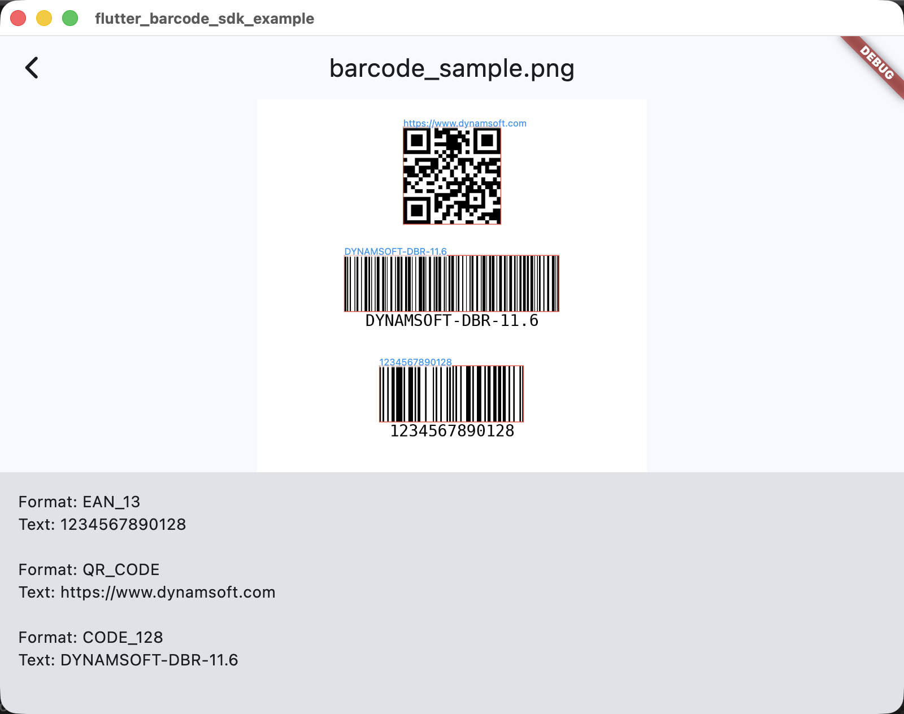

# flutter_barcode_sdk

[](https://pub.dev/packages/flutter_barcode_sdk)
[](https://github.com/yushulx/flutter_barcode_sdk/blob/main/LICENSE)

A cross-platform Flutter plugin for barcode reading and scanning, powered by the [Dynamsoft Barcode Reader SDK](https://www.dynamsoft.com/barcode-reader/overview/). Supports **Android**, **iOS**, **Web**, **Windows**, **Linux**, and **macOS**.

Decode a wide range of 1D and 2D barcode symbologies from image files and raw pixel buffers. Build robust barcode reader and scanner applications with minimal effort.



The plugin accepts image **files** or **raw pixel buffers**, so it composes with any camera plugin — for example [`flutter_lite_camera`](https://pub.dev/packages/flutter_lite_camera), which provides live camera preview and frame capture on the same six platforms. The bundled example app uses exactly this combination.

> **Need more than barcodes?** [`flutter_capture_vision`](https://pub.dev/packages/flutter_capture_vision) is built on the same architecture and additionally supports MRZ (passport/ID) recognition and document boundary detection on Android, iOS, Web, Windows, Linux, and macOS.

> **Tip:** If you only target **Android and iOS**, consider the official [Dynamsoft Capture Vision Flutter Edition](https://pub.dev/packages/dynamsoft_capture_vision_flutter) for production-grade live camera scanning with optimized real-time performance. Dynamsoft does not officially support that edition on Web, Windows, Linux, or macOS — for those platforms (or a single code base covering all six), use this package together with a camera plugin such as [`flutter_lite_camera`](https://pub.dev/packages/flutter_lite_camera).


## Table of Contents

- [Getting Started](#getting-started)
- [Supported Platforms](#supported-platforms)
- [Supported Barcode Symbologies](#supported-barcode-symbologies)
- [Platform Configuration](#platform-configuration)
- [Usage](#usage)
- [API Reference](#api-reference)
- [Examples](#examples)
- [License](#license)


## Getting Started

### 1. Install the Package

```yaml
dependencies:
  flutter_barcode_sdk: ^5.3.0
```

### 2. Obtain a License Key

A valid license is required to activate barcode decoding functionality.

[](https://www.dynamsoft.com/customer/license/trialLicense/?product=dcv&package=cross-platform)

### 3. Initialize the SDK

```dart
import 'package:flutter_barcode_sdk/flutter_barcode_sdk.dart';

final barcodeReader = FlutterBarcodeSdk();
await barcodeReader.setLicense('YOUR-LICENSE-KEY');
await barcodeReader.init();
```

## Supported Platforms

| Platform | Status |
|----------|--------|
| Android  | Supported      |
| iOS      | Supported      |
| Web      | Supported      |
| Windows  | Supported      |
| Linux    | Supported      |
| macOS    | Supported      |


## Supported Barcode Symbologies

### Linear Barcodes (1D)

Code 39 (including Extended) | Code 93 | Code 128 | Code 11 | Code 32 | Codabar | Interleaved 2 of 5 | Industrial 2 of 5 | Matrix 2 of 5 | EAN-8 | EAN-13 | UPC-A | UPC-E | MSI Code | Telepen | Telepen Numeric

### 2D Barcodes

QR Code (including Micro QR) | Data Matrix | PDF417 (including Micro PDF417) | Aztec Code | MaxiCode (modes 2-5) | DotCode

### GS1 DataBar

Omnidirectional | Truncated | Stacked | Stacked Omnidirectional | Expanded | Expanded Stacked | Limited

### Postal Codes

USPS Intelligent Mail | Postnet | Planet | Australian Post | Royal Mail (RM4SCC) | KIX

### Other

Patch Code | GS1 Composite Code | Pharmacode (One-Track / Two-Track) | Non-standard Barcode


## Platform Configuration

### Android

Set the minimum SDK version in `android/app/build.gradle`:

```groovy
minSdkVersion 21
```

### iOS

Add camera usage descriptions to `ios/Runner/Info.plist`:

```xml
<key>NSCameraUsageDescription</key>
<string>Camera access is required for barcode scanning.</string>
<key>NSMicrophoneUsageDescription</key>
<string>Microphone access is required by the camera plugin.</string>
```

### Windows and Linux

Ensure `CMake` and a platform-specific C++ compiler are installed.

### macOS

Requires macOS 12+, Xcode 14+, and CocoaPods. The first build runs
`pod install` automatically.

You must also bundle the Dynamsoft `Templates/` and `Models/` resource
folders into your app, otherwise the SDK fails with
`InitSettings error -10030`. A Flutter plugin cannot do this for you, so
add the `Copy Dynamsoft Resources` build phase to your Runner target —
the easiest way is pasting the ready-made `post_install` snippet from
[flutter_barcode_sdk_macos/README.md](https://github.com/yushulx/flutter_barcode_sdk/tree/main/packages/flutter_barcode_sdk_macos#dynamsoft-resources-in-your-own-app-required)
into your `macos/Podfile` and running `pod install`.

Grant these entitlements in your app's `macos/Runner/*.entitlements`
(the bundled example already has them):

```xml
<key>com.apple.security.network.client</key><true/>
<key>com.apple.security.device.camera</key><true/>
<key>com.apple.security.files.user-selected.read-write</key><true/>
```

And add the camera usage description to `macos/Runner/Info.plist`:

```xml
<key>NSCameraUsageDescription</key>
<string>Camera access is required for barcode scanning.</string>
```

### Web

No manual setup is required. The Dynamsoft JavaScript/WASM bundle is
self-hosted as package assets of the endorsed `flutter_barcode_sdk_web`
package and is loaded automatically at runtime — there is no CDN
`<script>` tag to add to `index.html`. Just serve the app over HTTPS or
`localhost`, as required for WASM.


## Usage

### Decode from an Image File

```dart
List<BarcodeResult> results = await barcodeReader.decodeFile('path/to/image.png');

for (var result in results) {
  print('${result.format}: ${result.text}');
}
```

### Decode from a Camera Buffer

The plugin itself is camera-agnostic: feed it raw frames from any camera
plugin. [`flutter_lite_camera`](https://pub.dev/packages/flutter_lite_camera)
opens the preview and captures RGB frames on all six platforms:

```dart
List<BarcodeResult> results = await barcodeReader.decodeImageBuffer(
  bytes,      // Uint8List - raw pixel data
  width,      // Image width
  height,     // Image height
  stride,     // Bytes per row
  format,     // Pixel format index (e.g., ImagePixelFormat.IPF_NV21.index)
  rotation,   // 0, 90, 180, or 270
);
```

### Set Barcode Formats

```dart
await barcodeReader.setBarcodeFormats(
  BarcodeFormat.QR_CODE | BarcodeFormat.CODE_128 | BarcodeFormat.EAN_13,
);
```

### Configure Advanced Parameters

```dart
String params = await barcodeReader.getParameters();
// Modify the JSON string as needed...
await barcodeReader.setParameters(params);
```

## API Reference

| Method | Description | Return |
|--------|-------------|--------|
| `setLicense(String license)` | Activates the SDK with a license key. | `Future<int>` |
| `init()` | Initializes the barcode reader with default parameters. | `Future<int>` |
| `decodeFile(String filename)` | Decodes barcodes from an image file. | `Future<List<BarcodeResult>>` |
| `decodeImageBuffer(...)` | Decodes barcodes from raw pixel data (camera preview, etc.). | `Future<List<BarcodeResult>>` |
| `setBarcodeFormats(int formats)` | Sets which barcode formats to detect. | `Future<int>` |
| `getParameters()` | Returns the current detection settings as JSON. | `Future<String>` |
| `setParameters(String params)` | Updates detection settings from a JSON string. | `Future<int>` |

See `BarcodeFormat` for all available format constants and `ImagePixelFormat` for supported pixel formats. Both are exported from `package:flutter_barcode_sdk/flutter_barcode_sdk.dart`.

## Federated Packages

Since v5.0.0, this plugin is a **federated plugin** following the Flutter
[camera package](https://github.com/flutter/packages/tree/main/packages/camera)
pattern. Platform implementations are separate packages that are endorsed
automatically — there is no need to add them to your `pubspec.yaml`:

| Package | Platform |
|---------|----------|
| `flutter_barcode_sdk_platform_interface` | Platform interface contract |
| `flutter_barcode_sdk_android` | Android |
| `flutter_barcode_sdk_macos` | macOS |
| `flutter_barcode_sdk_ios` | iOS |
| `flutter_barcode_sdk_windows` | Windows |
| `flutter_barcode_sdk_linux` | Linux |
| `flutter_barcode_sdk_web` | Web (self-hosted JS/WASM bundle) |

Each platform package is versioned and published independently, so each
platform can be updated without affecting the others.


## Examples

### Mobile (Android / iOS)

```bash
cd example
flutter run
```


### Desktop (Windows / Linux / macOS)

```bash
cd example
flutter run -d windows   # or -d linux/macos
```

### Web

```bash
cd example
flutter run -d chrome
```
